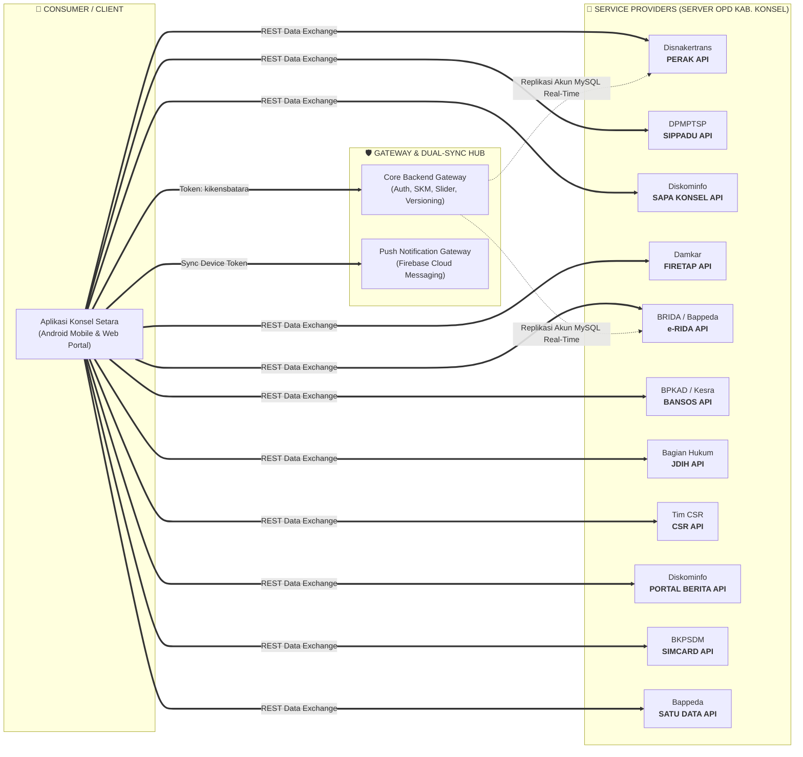
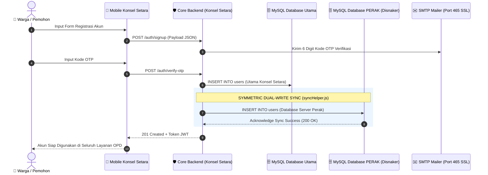

# API OVERVIEW — SYMMETRY DOCS (ARSITEKTUR PERTUKARAN DATA SIMETRIS)
## SISTEM TERPADU & SUPERAPP "KONSEL SETARA" — KABUPATEN KONAWE SELATAN

---

| Dokumen | Standar Spesifikasi API Simetris (*Symmetry Documentation*) |
| :--- | :--- |
| **Sistem Utama** | Konsel Setara (SuperApp Pelayanan Publik & Pemerintahan) |
| **Penyusun** | Tim Pengembang & Tim SPBE Dinas Komunikasi, Informatika dan Persandian |
| **Klasifikasi** | Technical Data Contract & Interoperability Architecture |
| **Tanggal Efektif** | September 2026 |
| **Versi Dokumen** | v2.0 (Symmetry Specification) |

---

## 1. KONSEP & PRINSIP SYMMETRY DOCS

**Symmetry Docs** adalah metodologi dokumentasi antarmuka pemrograman aplikasi (API) yang menyajikan relasi dua arah secara seimbang dan simetris (*balanced two-way contract*) antara **Consumer** (Aplikasi Mobile/Web Konsel Setara) dan **Provider** (Server-server Sektoral OPD).

Setiap spesifikasi layanan disusun dengan prinsip **4-Pilar Simetri**:
1. **Contract Symmetry**: Setiap *Input Schema* (Request) dipasangkan secara presisi dengan *Output Schema* (Response).
2. **Security Symmetry**: Seluruh protokol otentikasi dipetakan seragam (*Token Bearer*, *Custom Header*, *API Key*, dan *Public Open Access*).
3. **Data Envelope Symmetry**: Standarisasi pembungkus respons (`success`, `message`, `data`, `meta`) di seluruh domain layanan.
4. **State Symmetry**: Pemetaan status HTTP kode sukses ($2xx$) dan kode kegagalan ($4xx / 5xx$) yang konsisten.

---

## 2. STANDARISASI PROTOKOL & ENVELOPE RESPON SIMETRIS

### 2.1. Standar Format Header Permintaan (Request Headers)
Semua pertukaran data API di lingkungan Pemkab Konawe Selatan mengikuti konvensi simetris berikut:

```http
Content-Type: application/json
Accept: application/json
Authorization: kikensbatara <JWT_BEARER_TOKEN>
```
> *Catatan*: Pada layanan Firetap menggunakan prefix `xxx <TOKEN>`, pada API upload berkas menggunakan `Content-Type: application/octet-stream` dengan custom header `File-Name: <nama_file>`, dan pada gateway notifikasi menggunakan header `x-api-key: <NOTIF_API_KEY>`.

### 2.2. Pola Simetri Respons (Response Envelope)

#### A. Respons Sukses Simetris (HTTP 200 / 201)
```json
{
  "success": true,
  "statusCode": 200,
  "message": "Operasi pengambilan / pemrosesan data berhasil",
  "data": { ... },
  "meta": {
    "total": 120,
    "page": 1,
    "limit": 10
  }
}
```

#### B. Respons Error Simetris (HTTP 400 / 401 / 403 / 422 / 500)
```json
{
  "success": false,
  "statusCode": 422,
  "message": "Validasi gagal: Format NIK atau nomor handphone tidak valid",
  "error": "UNPROCESSABLE_ENTITY",
  "stack": null
}
```

### 2.3. Matriks Status HTTP Simetris

| Kode HTTP | Status Semantik | Sisi Klien (Consumer) | Sisi Server (Provider) |
| :---: | :--- | :--- | :--- |
| **`200 OK`** | Permintaan Berhasil | Menerima data payload untuk dirender ke UI | Mengirimkan data entitas JSON |
| **`201 Created`** | Data Berhasil Dibuat | Menampilkan alert sukses & redirect form | Record baru tersimpan di database |
| **`400 Bad Request`** | Parameter Tidak Lengkap | Memperbaiki format body JSON | Menolak proses, data input invalid |
| **`401 Unauthorized`** | Token Kedaluwarsa / Tiada | Redirect otomatis ke halaman login | Menolak akses, token tidak valid |
| **`403 Forbidden`** | Akses Terlarang | Menampilkan pesan hak akses ditolak | Validasi API Key / Role gagal |
| **`404 Not Found`** | Sumber Daya Tidak Ada | Menampilkan empty state / 404 UI | Entitas ID tidak ditemukan di DB |
| **`500 Server Error`** | Kesalahan Internal | Menampilkan alert "Server sedang gangguan" | Logging query error / exception |

---

## 3. PETA ARSITEKTUR SIMETRIS EKOSISTEM LAYANAN



---

## 4. KATALOG SPESIFIKASI API SIMETRIS (SYMMETRIC API SPECIFICATIONS)

---

### [SPEC-01] LAYANAN KETENAGAKERJAAN & KARTU KUNING (PERAK)
- **Producer / Server**: `https://serverperak.konaweselatankab.go.id/api/v1/`
- **Consumer**: `KonselSetara/Mobile/PerakModule`
- **Auth Pattern**: `Authorization: kikensbatara <JWT_TOKEN>`
- **Kode Sumber Terkait**: [`perak.service.js`](file:///Users/dinaskominfo/AplikasiKonsel/konsel-setara/frontend/src/services/perak.service.js)

#### Kontrak Simetris: Pengambilan Master Wilayah & Pendidikan
| Parameter | Spesifikasi Sisi Request (Consumer) | Spesifikasi Sisi Response (Provider) |
| :--- | :--- | :--- |
| **Endpoint** | `POST m_des_kel/list` | Status: `200 OK` |
| **Headers** | `Authorization: kikensbatara <token>`<br/>`Content-Type: application/json` | `Content-Type: application/json` |
| **Payload Schema** | ```json<br/>{<br/>  "kecamatan_id": 14<br/>}<br/>``` | ```json<br/>[<br/>  {<br/>    "id": 102,<br/>    "kecamatan_id": 14,<br/>    "nama_des_kel": "Andoolo Utama"<br/>  }<br/>]<br/>``` |

#### Kontrak Simetris: Pengajuan Biodata AK.1 (Pencari Kerja)
| Parameter | Spesifikasi Sisi Request (Consumer) | Spesifikasi Sisi Response (Provider) |
| :--- | :--- | :--- |
| **Endpoint** | `POST keterangan_umum/addData` | Status: `200 OK` / `201 Created` |
| **Headers** | `Authorization: kikensbatara <token>` | `Content-Type: application/json` |
| **Payload Schema** | ```json<br/>{<br/>  "nik": "740501xxxxxxxxxx",<br/>  "nama_lengkap": "Ahmad Fauzi",<br/>  "tmp_lahir": "Andoolo",<br/>  "tgl_lahir": "1998-05-12",<br/>  "jenis_kelamin": "L",<br/>  "agama_id": 1,<br/>  "status_nikah_id": 1,<br/>  "kecamatan_id": 14,<br/>  "des_kel_id": 102,<br/>  "alamat": "Jl. Poros Andoolo No. 45"<br/>}<br/>``` | ```json<br/>{<br/>  "success": true,<br/>  "message": "Biodata pencari kerja berhasil didaftarkan",<br/>  "id": 4821,<br/>  "no_pendaftaran": "AK1-2026-004821"<br/>}<br/>``` |

---

### [SPEC-02] LAYANAN PERIZINAN TERPADU & REGULASI (SIPPADU)
- **Producer / Server**: `https://server-sippadu.konaweselatankab.go.id/api/v1/`
- **Consumer**: `KonselSetara/Mobile/SippaduModule`
- **Auth Pattern**: `Authorization: kikensbatara <JWT_TOKEN>` & Raw Binary
- **Kode Sumber Terkait**: [`sippadu.service.js`](file:///Users/dinaskominfo/AplikasiKonsel/konsel-setara/frontend/src/services/sippadu.service.js)

#### Kontrak Simetris: Publikasi Peraturan Daerah (Perda / Perkada)
| Parameter | Spesifikasi Sisi Request (Consumer) | Spesifikasi Sisi Response (Provider) |
| :--- | :--- | :--- |
| **Endpoint** | `GET publish_peraturan/perda` | Status: `200 OK` |
| **Payload** | *Empty (None)* | ```json<br/>[<br/>  {<br/>    "id": 85,<br/>    "nomor": "03",<br/>    "tahun": "2024",<br/>    "judul": "Penyelenggaraan Perizinan Berusaha di Daerah",<br/>    "file_url": "https://server-sippadu.../perda_03_2024.pdf"<br/>  }<br/>]<br/>``` |

#### Kontrak Simetris: Upload Berkas Syarat Izin (Binary Octet-Stream)
| Parameter | Spesifikasi Sisi Request (Consumer) | Spesifikasi Sisi Response (Provider) |
| :--- | :--- | :--- |
| **Endpoint** | `POST /api/v1/laporan` | Status: `200 OK` |
| **Headers** | `Content-Type: application/octet-stream`<br/>`File-Name: KTP_740501xxxx.pdf`<br/>`Authorization: kikensbatara <token>` | `Content-Type: application/json` |
| **Payload** | `[Raw Binary Buffer / File Blob]` | ```json<br/>{<br/>  "status": "success",<br/>  "fileName": "KTP_740501xxxx_17270512.pdf",<br/>  "path": "/uploads/laporan/..."<br/>}<br/>``` |

---

### [SPEC-03] LAYANAN PENGADUAN WARGA (SAPA KONSEL)
- **Producer / Server**: `https://serversapakonsel.konaweselatankab.go.id/api/v1/`
- **Consumer**: `KonselSetara/Mobile/SapaModule`
- **Auth Pattern**: `Authorization: kikensbatara <JWT_TOKEN>` & Form-Data
- **Kode Sumber Terkait**: [`sapa.service.js`](file:///Users/dinaskominfo/AplikasiKonsel/konsel-setara/frontend/src/services/sapa.service.js)

#### Kontrak Simetris: Laporan Pengaduan & Tracking Tindak Lanjut
| Parameter | Spesifikasi Sisi Request (Consumer) | Spesifikasi Sisi Response (Provider) |
| :--- | :--- | :--- |
| **Endpoint** | `POST publish_laporan/view` | Status: `200 OK` |
| **Payload Schema** | ```json<br/>{<br/>  "users_id": "usr_99120",<br/>  "page": 1,<br/>  "limit": 10<br/>}<br/>``` | ```json<br/>{<br/>  "data": [<br/>    {<br/>      "id": 312,<br/>      "judul": "Kerusakan Lampu Jalan Poros",<br/>      "status": "DIPROSES",<br/>      "opd_tujuan": "Dinas Perhubungan",<br/>      "tanggapan": "Petugas teknis sedang meluncur ke lokasi",<br/>      "updatedAt": "2026-09-22 14:10:00"<br/>    }<br/>  ]<br/>}<br/>``` |

---

### [SPEC-04] LAYANAN TANGGAP DARURAT & PENYELAMATAN (FIRETAP DAMKAR)
- **Producer / Server**: `https://server-firetap.konaweselatankab.go.id/`
- **Consumer**: `KonselSetara/Mobile/FiretapModule`
- **Auth Pattern**: `Authorization: xxx <TOKEN>`
- **Kode Sumber Terkait**: [`firetap.service.js`](file:///Users/dinaskominfo/AplikasiKonsel/konsel-setara/frontend/src/services/firetap.service.js)

#### Kontrak Simetris: Sinyal Darurat Kebakaran (SOS Alert Mobile)
| Parameter | Spesifikasi Sisi Request (Consumer) | Spesifikasi Sisi Response (Provider) |
| :--- | :--- | :--- |
| **Endpoint** | `POST api/v1/server_kasus/addMobile` | Status: `201 Created` |
| **Headers** | `Authorization: xxx <token>` | `Content-Type: application/json` |
| **Payload Schema** | ```json<br/>{<br/>  "latitude": -4.241512,<br/>  "longitude": 122.389121,<br/>  "alamat_kejadian": "Desa Motaha, Kec. Angata",<br/>  "deskripsi": "Kebakaran lahan kering mendekati permukiman",<br/>  "pelapor_hp": "0812xxxxxxxx"<br/>}<br/>``` | ```json<br/>{<br/>  "success": true,<br/>  "message": "Laporan darurat berhasil disiarkan ke posko terdekat",<br/>  "incident_id": "DAMKAR-2026-089",<br/>  "posko_penanganan": "Posko Sektor Angata"<br/>}<br/>``` |

---

### [SPEC-05] LAYANAN RISET, INOVASI & HAKI (e-RIDA)
- **Producer / Server**: `https://server-erida.konaweselatankab.go.id/api/v1/`
- **Consumer**: `KonselSetara/Mobile/EridaModule`
- **Auth Pattern**: `Authorization: kikensbatara <JWT_TOKEN>`
- **Kode Sumber Terkait**: [`erida.service.js`](file:///Users/dinaskominfo/AplikasiKonsel/konsel-setara/frontend/src/services/erida.service.js)

#### Kontrak Simetris: Pendaftaran Inovasi Daerah (Krenova) & Indikator
| Parameter | Spesifikasi Sisi Request (Consumer) | Spesifikasi Sisi Response (Provider) |
| :--- | :--- | :--- |
| **Endpoint** | `POST publish_manis/krenova` | Status: `200 OK` |
| **Payload Schema** | ```json<br/>{<br/>  "judul_inovasi": "Sistem Irigasi Tetes Otomatis Berbasis IoT",<br/>  "kategori": "Masyarakat",<br/>  "nama_inovator": "Kelompok Tani Maju",<br/>  "kecamatan_id": 5,<br/>  "abstrak": "Penghematan air pada lahan hortikultura..."<br/>}<br/>``` | ```json<br/>{<br/>  "status": "success",<br/>  "message": "Proposal Krenova berhasil disubmit untuk dinilai",<br/>  "krenova_id": 94<br/>}<br/>``` |

---

### [SPEC-06] LAYANAN BANTUAN SOSIAL & DANA HIBAH (BANSOS)
- **Producer / Server**: `https://server.hibah.konaweselatankab.go.id/`
- **Consumer**: `KonselSetara/Mobile/BansosModule`
- **Auth Pattern**: `Authorization: kikensbatara <JWT_TOKEN>`
- **Kode Sumber Terkait**: [`bansos.service.js`](file:///Users/dinaskominfo/AplikasiKonsel/konsel-setara/frontend/src/services/bansos.service.js)

#### Kontrak Simetris: Verifikasi Penerima Bantuan via NIK KTP
| Parameter | Spesifikasi Sisi Request (Consumer) | Spesifikasi Sisi Response (Provider) |
| :--- | :--- | :--- |
| **Endpoint** | `POST public/v1/dashboard/searchNik` | Status: `200 OK` |
| **Payload Schema** | ```json<br/>{<br/>  "nik": "7405011002950001"<br/>}<br/>``` | ```json<br/>{<br/>  "ditemukan": true,<br/>  "data": {<br/>    "nama": "Sitti Nurhaliza",<br/>    "program": "Bantuan Bibit Perkebunan 2026",<br/>    "status_penyaluran": "Telah Disalurkan",<br/>    "tanggal": "2026-08-15"<br/>  }<br/>}<br/>``` |

---

### [SPEC-07] LAYANAN JDIH (JARINGAN DOKUMENTASI HUKUM)
- **Producer / Server**: `https://server.jdih.konaweselatankab.go.id/api/v1/`
- **Consumer**: `KonselSetara/Mobile/JdihModule`
- **Auth Pattern**: Public Accessible & Token Interceptor
- **Kode Sumber Terkait**: [`jdih.service.js`](file:///Users/dinaskominfo/AplikasiKonsel/konsel-setara/frontend/src/services/jdih.service.js)

#### Kontrak Simetris: Pencarian Produk Hukum & Regulasi
| Parameter | Spesifikasi Sisi Request (Consumer) | Spesifikasi Sisi Response (Provider) |
| :--- | :--- | :--- |
| **Endpoint** | `POST publish_produk_hukum/views` | Status: `200 OK` |
| **Payload Schema** | ```json<br/>{<br/>  "search": "Pajak Daerah",<br/>  "tahun": "2025",<br/>  "page": 1<br/>}<br/>``` | ```json<br/>{<br/>  "rows": [<br/>    {<br/>      "id": 142,<br/>      "tipe": "Peraturan Daerah",<br/>      "nomor": "1",<br/>      "tahun": "2025",<br/>      "tentang": "Pajak Daerah dan Retribusi Daerah",<br/>      "status_berlaku": "Berlaku"<br/>    }<br/>  ]<br/>}<br/>``` |

---

### [SPEC-08] LAYANAN CORPORATE SOCIAL RESPONSIBILITY (CSR)
- **Producer / Server**: `https://server-csr.konaweselatankab.go.id/`
- **Consumer**: `KonselSetara/Mobile/CsrModule`
- **Auth Pattern**: `Authorization: kikensbatara <JWT_TOKEN>`
- **Kode Sumber Terkait**: [`csr.service.js`](file:///Users/dinaskominfo/AplikasiKonsel/konsel-setara/frontend/src/services/csr.service.js)

#### Kontrak Simetris: Realisasi Kegiatan CSR & Kemitraan Perusahaan
| Parameter | Spesifikasi Sisi Request (Consumer) | Spesifikasi Sisi Response (Provider) |
| :--- | :--- | :--- |
| **Endpoint** | `POST api/v1/publish/kegiatanCSR/kegiatanCSRview` | Status: `200 OK` |
| **Payload Schema** | ```json<br/>{<br/>  "bidang_id": 2,<br/>  "kecamatan_id": 7,<br/>  "tahun": 2026<br/>}<br/>``` | ```json<br/>[<br/>  {<br/>    "id": 67,<br/>    "nama_perusahaan": "PT. Konsel Mineral Mandiri",<br/>    "program": "Pemberian Beasiswa Santri",<br/>    "anggaran_realisasi": 150000000,<br/>    "lokasi": "Kecamatan Kolono"<br/>  }<br/>]<br/>``` |

---

### [SPEC-09] LAYANAN PORTAL BERITA & PENYIARAN INFORMASI DAERAH
- **Producer / Server**: `https://server-web.konaweselatankab.go.id/api/v1/`
- **Consumer**: `KonselSetara/Mobile/NewsModule`
- **Auth Pattern**: Public Open Interface
- **Kode Sumber Terkait**: [`berita.service.js`](file:///Users/dinaskominfo/AplikasiKonsel/konsel-setara/frontend/src/services/berita.service.js)

#### Kontrak Simetris: Sindikasi Berita Resmi Pemkab Konsel
| Parameter | Spesifikasi Sisi Request (Consumer) | Spesifikasi Sisi Response (Provider) |
| :--- | :--- | :--- |
| **Endpoint** | `POST web_publish_berita/view` | Status: `200 OK` |
| **Payload Schema** | ```json<br/>{<br/>  "page": 1,<br/>  "limit": 6<br/>}<br/>``` | ```json<br/>[<br/>  {<br/>    "id": 912,<br/>    "judul": "Bupati Konawe Selatan Resmikan Sentra UMKM Terpadu",<br/>    "kategori": "Perekonomian",<br/>    "gambar_utama": "https://server-web.../berita_912.jpg",<br/>    "created_at": "2026-09-21T09:00:00.000Z"<br/>  }<br/>]<br/>``` |

---

### [SPEC-10] LAYANAN PORTAL SATU DATA (OPEN DATA KAB. KONSEL)
- **Producer / Server**: `http://81.17.99.110:5005/api/public/`
- **Consumer**: `KonselSetara/Mobile/DataModule`
- **Auth Pattern**: Public JSON API
- **Kode Sumber Terkait**: [`data.service.js`](file:///Users/dinaskominfo/AplikasiKonsel/konsel-setara/frontend/src/services/data.service.js)

#### Kontrak Simetris: Indikator Makro & Sektoral OPD
| Parameter | Spesifikasi Sisi Request (Consumer) | Spesifikasi Sisi Response (Provider) |
| :--- | :--- | :--- |
| **Endpoint** | `GET dashboard?tahun=2026` | Status: `200 OK` |
| **Payload** | *Query Parameter: `tahun=2026`* | ```json<br/>{<br/>  "status": "success",<br/>  "data": {<br/>    "ipm": 71.45,<br/>    "pertumbuhan_ekonomi": 5.82,<br/>    "kemiskinan": 9.12,<br/>    "total_opd_produsen": 34<br/>  }<br/>}<br/>``` |

---

### [SPEC-11] CORE AUTHENTICATION & SINGLE SIGN-ON (SSO)
- **Producer / Server**: `https://konsel-setara.konaweselatankab.go.id/auth/`
- **Consumer**: `KonselSetara/Client/AuthStore`
- **Auth Pattern**: Public $\rightarrow$ Menghasilkan JWT `kikensbatara`
- **Kode Sumber Terkait**: [`backend/auth/index.js`](file:///Users/dinaskominfo/AplikasiKonsel/konsel-setara/backend/auth/index.js) & [`auth.service.js`](file:///Users/dinaskominfo/AplikasiKonsel/konsel-setara/frontend/src/services/auth.service.js)

#### Kontrak Simetris: Autentikasi Pengguna & Penerbitan Token
| Parameter | Spesifikasi Sisi Request (Consumer) | Spesifikasi Sisi Response (Provider) |
| :--- | :--- | :--- |
| **Endpoint** | `POST auth/login` | Status: `200 OK` |
| **Payload Schema** | ```json<br/>{<br/>  "username": "masyarakat01",<br/>  "password": "PasswordAman123!"<br/>}<br/>``` | ```json<br/>{<br/>  "token": "eyJhbGciOiJIUzI1NiIsInR5cCI...",<br/>  "user": {<br/>    "id": "usr_99120",<br/>    "username": "masyarakat01",<br/>    "nama": "Budi Santoso",<br/>    "email": "budi@gmail.com",<br/>    "hp": "081234567890"<br/>  }<br/>}<br/>``` |

---

### [SPEC-12] GATEWAY PUSH NOTIFIKASI ANTAR-SISTEM (FCM v1 GATEWAY)
- **Producer / Server**: `https://konsel-setara.konaweselatankab.go.id/notification/`
- **Consumer (Caller)**: Server Sektoral OPD (Perak, Sippadu, SapaKonsel, dll)
- **Receiver (Target)**: Perangkat Android Pengguna Aplikasi Konsel Setara
- **Auth Pattern**: Header `x-api-key: <NOTIF_API_KEY>`
- **Kode Sumber Terkait**: [`backend/routes/notification.js`](file:///Users/dinaskominfo/AplikasiKonsel/konsel-setara/backend/routes/notification.js)

#### Kontrak Simetris: Pengiriman Notifikasi Push Lintas Server
| Parameter | Spesifikasi Sisi Request (Caller: Server OPD) | Spesifikasi Sisi Response (Gateway Konsel Setara) |
| :--- | :--- | :--- |
| **Endpoint** | `POST notification/send` | Status: `200 OK` |
| **Headers** | `x-api-key: YOUR_NOTIF_API_KEY`<br/>`Content-Type: application/json` | `Content-Type: application/json` |
| **Payload Schema** | ```json<br/>{<br/>  "userId": "usr_99120",<br/>  "title": "Status Izin Terbit",<br/>  "body": "Permohonan Izin Usaha Anda telah selesai diproses.",<br/>  "data": {<br/>    "module": "SIPPADU",<br/>    "permohonanId": "IZIN-7781"<br/>  }<br/>}<br/>``` | ```json<br/>{<br/>  "success": true,<br/>  "tokensCount": 1,<br/>  "response": {<br/>    "name": "projects/konselsetara/messages/fcm_msg_id_..."<br/>  }<br/>}<br/>``` |

---

## 5. SIMETRI SINKRONISASI TINGKAT BASIS DATA (DUAL-WRITE REPLICATION)

Diagram simetri alur pendaftaran akun pengguna dan sinkronisasi lintas basis data:



---

## 6. VALIDASI & PANDUAN AUDIT INTEGRASI

Bagi auditor sistem informasi, asesor SPBE, maupun tim penguji independen, keabsahan seluruh kontrak pertukaran data API di atas dapat diverifikasi dengan metode:

1. **Uji Langsung Endpoint (*Live Ping / cURL*)**:
   ```bash
   curl -X POST https://serverperak.konaweselatankab.go.id/api/v1/m_kecamatan/list \
     -H "Content-Type: application/json"
   ```
2. **Inspeksi Interceptor Jaringan Aplikasi (*Network Tab*)**:
   - Buka aplikasi Konsel Setara di browser atau emulator Android.
   - Buka panel DevTools $\rightarrow$ **Network** $\rightarrow$ **Fetch/XHR**.
   - Klik modul layanan (misal: "Bansos" atau "JDIH"), akan terlihat pertukaran data dua arah secara simetris sesuai spesifikasi payload di dokumen ini.
3. **Verifikasi Kredensial & SSL**:
   - Seluruh endpoint production menggunakan sertifikat TLS/SSL resmi berakhiran domain pemerintah daerah (`.konaweselatankab.go.id`).

---
*Dokumen ini merupakan panduan spesifikasi teknis simetris resmi sistem integrasi Konsel Setara.*
