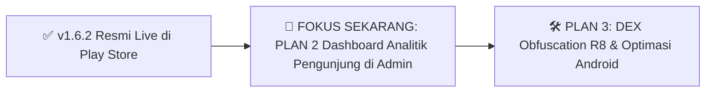

# 📌 MASTER ROADMAP & PLAN PENGEMBANGAN: KONSEL SETARA

Dokumen ini adalah **panduan acuan rencana kerja terpusat**. Kapan pun Anda memulai sesi kerja dan menanyakan _"apa plan selanjutnya?"_, dokumen ini menjadi acuan status pekerjaan yang sudah selesai dan antrean fitur yang siap dikerjakan.

---

## 🏆 STATUS TERAKHIR (RILIS v1.6.2)

| Komponen                        |        Status        | Catatan Rilis                                                                                                                               |
| :------------------------------ | :------------------: | :------------------------------------------------------------------------------------------------------------------------------------------ |
| **Mobile Android**              | 🚀 **RESMI LIVE**    | Versi **`1.6.2` (kode `11`)** resmi disetujui Google Play Store dan live ke publik dengan fitur **Konsultasi LPSE / Tiket SLA Pengadaan**. |
| **Konsultasi LPSE (SLA Tiket)** |    ✅ **SELESAI**    | Formulir konsultasi PBJ, lampiran kamera/galeri, tracking status tiket, komentar interaktif, dan offline fallback storage.                  |
| **Backend Visitor & Menu**      |    ✅ **SELESAI**    | Endpoint `/api/v1/visitors/*` & `/api/v1/menu/upload` aktif melayani aplikasi & admin.                                                      |
| **Plan 1: Upload Logo Dinamis** |    ✅ **SELESAI**    | Admin web bisa upload logo gambar mandiri, backend melayani static storage & mobile `IndexPage.vue` otomatis render logo remote.            |

---

## 🚀 PRIORITAS PENGEMBANGAN BERIKUTNYA



---

## 🛠️ ROADMAP PENGEMBANGAN FITUR SELANJUTNYA

### ✅ PLAN 1: Sistem Upload Logo & Menu Dinamis (Admin, Backend & Mobile) — [SELESAI]

> **Status**: **100% Selesai**. Backend endpoint upload aktif, Web Admin memiliki picker upload & preview live mock, dan Mobile Android v1.6.1 telah mendukung pembacaan URL remote.

---

### 🎯 PLAN 2: Modul Analitik & Statistik Pengunjung di Web Admin (`admin/`) — [FOKUS SAAT INI]

> **Tujuan Utama**: Menyajikan dashboard pemantauan statistik pengunjung aplikasi Konsel Setara secara komprehensif bagi pimpinan dan pengelola sistem Diskominfo.

#### 1. Sisi Backend (`backend/`):

- **Endpoint Baru**: `GET /api/v1/visitors/analytics?range=7|30|year`
- **Payload Respons**:
  - Ringkasan KPI: Total Pengunjung, Pengunjung Hari Ini, Bulan Ini, Rata-rata Harian, Hari Puncak (_Peak Day_).
  - Data Tren Harian: Array `{ date: '2026-09-28', count: 145 }` untuk kebutuhan grafik.
  - Komposisi Platform: Breakdown jumlah kunjungan dari `android`, `ios`, dan `web`.

#### 2. Sisi Web Admin (`admin/`):

- **Menu Baru Sidebar**: **Statistik Pengunjung** (`/visitors` atau `/analytics`).
- **Komponen Visual**:
  - **4 Kartu KPI Ringkasan**: Desain modern dengan badge persentase tren naik/turun.
  - **Grafik Tren Interaktif**: Visualisasi Area/Line Chart menggunakan library `recharts`.
  - **Filter Rentang Waktu**: Tombol cepat _7 Hari_, _30 Hari_, _Bulan Ini_, _Tahun Ini_.
  - **Tabel Log Kunjungan**: Rincian harian beserta jumlah hit per tanggal.

---

### 🛠️ PLAN 3: Optimalisasi Kode DEX & Obfuscation R8 (`frontend/android`)
> **Tujuan Utama**: Memenuhi standar kualitas DEX Google Play Console (tenggat Feb 2027) dengan menaikkan persentase DEX Obfuscation di atas 25% dan memperkecil ukuran bundle aplikasi.

#### Rincian Tindakan:
1. **Konfigurasi `build.gradle`**:
   - Aktifkan `minifyEnabled true` dan `shrinkResources true` pada `buildTypes.release`.
2. **Aturan ProGuard (`proguard-rules.pro`)**:
   - Lindungi antarmuka JavaScript-to-Native Capacitor (`@JavascriptInterface`).
   - Pertahankan plugin Capacitor (App, Browser, Device, Splash, dll.) agar tidak hilang/error saat di-obfuscate R8.
3. **Penyusutan Ukuran**:
   - Menyusutkan ukuran DEX uncompressed dari 15.3 MB menjadi jauh lebih ramping.
4. **Opsional (UI Layout)**:
   - Evaluasi peringatan deprecated API fullscreen/window insets untuk kompatibilitas Android 15+.

---

## 📱 STANDAR PROSEDUR RILIS & BUILD PLAY STORE (SOP UPDATE APLIKASI)

Setiap kali pengguna meminta **"update"** atau **"mau upload ke Play Store"**, jalankan alur kerja standar berikut secara otomatis:

### 1. Pengecekan & Kenaikan Versi (Wajib)
- **`versionCode`**: **WAJIB SELALU NAIK (+1)** dari versi Play Store sebelumnya agar tidak ditolak oleh Google Play Console (*error: version code already used*).
- **`versionName`**: Naikkan sesuai tipe rilis (`MAJOR.MINOR.PATCH`, misal: `1.6.1` ➔ `1.6.2`).

### 2. Sinkronisasi 5 Titik Versi Wajib
Pastikan nomor versi tersinkronisasi di kelima file berikut:
1. `frontend/android/app/build.gradle` (`versionCode` & `versionName`)
2. `frontend/package.json` (`version`)
3. `frontend/src/pages/Auth/LoginPage.vue` (`appVersion`)
4. `frontend/src/pages/ProfilPage.vue` (`appVersion`)
5. `backend/index.js` (`latestVersion`)

### 3. Eksekusi Kompilasi Build Otomatis
```bash
# 1. Kompilasi web assets SPA
cd frontend && npm run build

# 2. Sinkronkan assets & native plugins ke Capacitor Android
npx cap sync android

# 3. Kompilasi signed bundle release (.aab) & signed APK (.apk)
cd android && ./gradlew bundleRelease assembleRelease
```

### 4. Output & Laporan Akhir
Selalu sediakan laporan terstruktur mencakup:
- **Lokasi file `.aab`**: `frontend/android/app/build/outputs/bundle/release/app-release.aab`
- **Lokasi file `.apk`**: `frontend/android/app/build/outputs/apk/release/app-release.apk`
- **Konfirmasi Metadata**: `versionCode` dan `versionName` aktif
- **Draf Catatan Rilis (*Release Notes*)**: Siap copy-paste ke Google Play Console.

---

## 📌 CARA PENGGUNAAN PLAN INI

Setiap kali membuka sesi proyek berikutnya, Anda cukup mengatakan:  
👉 **"Lanjutkan Plan 2 (Dashboard Analitik Pengunjung di Admin)"**, **"Lanjutkan Plan 3 (Optimalisasi DEX R8 Android)"**, atau **"Mau build / upload ke Play Store"**, dan kita langsung mengeksekusi sesuai standar SOP!

