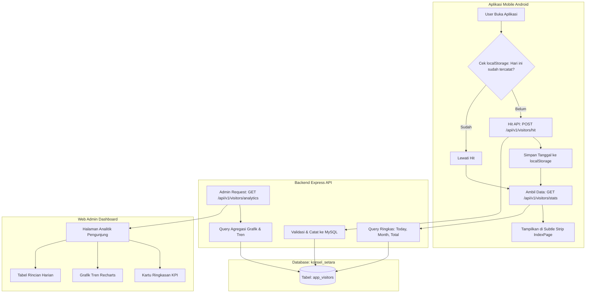

# 📌 RENCANA PENGEMBANGAN: SISTEM STATISTIK PENGUNJUNG (VISITOR COUNTER & ANALYTICS)
Proyek: **Konsel Setara (Konawe Selatan)**  
Status: **DRAFT / PERENCANAAN**  
Tanggal: **27 September 2026**

---

## 1. 🎯 Tujuan & Lingkup Fitur

Fitur statistik pengunjung dirancang untuk memantau trafik penggunaan aplikasi Konsel Setara secara akurat, transparan, dan terarah dengan pembagian peran:

1. **Aplikasi Android (`frontend/`)**:
   - Pencatatan otomatis (*hit*) di latar belakang saat aplikasi pertama kali dibuka tiap hari.
   - Menampilkan angka ringkas (*Hari Ini*, *Bulan Ini*, *Total*) sebagai pelengkap pada *subtle minimalist strip* di beranda.
2. **Web Admin Dashboard (`admin/`)**:
   - Modul khusus analitik yang komprehensif.
   - Grafik tren kunjungan (harian/bulanan), persentase kenaikan, perbandingan platform, dan log berkala.
3. **Backend API (`backend/`)**:
   - Penyedia endpoint pencatatan anti-spam & kalkulasi statistik yang efisien di database MySQL.

---

## 2. 🏗️ Arsitektur & Alur Kerja Data



---

## 3. 🗄️ Spesifikasi Database MySQL

Tabel baru dibuat pada database `konsel_setara`:

```sql
CREATE TABLE IF NOT EXISTS `app_visitors` (
  `id` BIGINT AUTO_INCREMENT PRIMARY KEY,
  `platform` VARCHAR(20) NOT NULL DEFAULT 'android', -- android, ios, web
  `ip_address` VARCHAR(45) NULL,
  `device_id` VARCHAR(100) NULL,
  `user_id` INT NULL,                               -- jika sudah login
  `visit_date` DATE NOT NULL,
  `created_at` DATETIME DEFAULT CURRENT_TIMESTAMP,
  INDEX idx_visit_date (`visit_date`),
  INDEX idx_platform (`platform`),
  INDEX idx_visit_user (`visit_date`, `ip_address`)
) ENGINE=InnoDB DEFAULT CHARSET=utf8mb4;
```

---

## 4. ⚙️ Spesifikasi Backend API (`backend/`)

File baru: [backend/apiMysql/visitors.js](file:///Users/simplephi/Documents/riswan/konsel-setara/backend/apiMysql/visitors.js)

### Endpoint 1: Pencatatan Kunjungan (Hit)
* **Method & Path:** `POST /api/v1/visitors/hit`
* **Body:**
  ```json
  {
    "platform": "android",
    "deviceId": "optional-uuid"
  }
  ```
* **Mekanisme Proteksi Anti-Spam:**
  - Pengecekan kombinasi IP + `visit_date` (atau deviceId jika tersedia). Jika dalam hari yang sama sudah pernah tercatat, backend tidak menduplikasi baris (idempotent).
* **Response:** `{ "success": true, "message": "Hit recorded" }`

### Endpoint 2: Statistik Ringkas untuk Mobile Android
* **Method & Path:** `GET /api/v1/visitors/stats`
* **Response:**
  ```json
  {
    "success": true,
    "data": {
      "today": 142,
      "thisMonth": 3820,
      "total": 28450
    }
  }
  ```

### Endpoint 3: Analitik Lengkap untuk Web Admin
* **Method & Path:** `GET /api/v1/visitors/analytics?range=30`
* **Query Params:** `range` (7 hari, 30 hari, atau bulan berjalan)
* **Response:**
  ```json
  {
    "success": true,
    "summary": {
      "totalVisitors": 28450,
      "todayVisitors": 142,
      "monthVisitors": 3820,
      "avgDailyVisitors": 127,
      "peakDay": { "date": "2026-09-21", "count": 245 }
    },
    "dailyTrends": [
      { "date": "2026-09-20", "count": 115 },
      { "date": "2026-09-21", "count": 245 },
      { "date": "2026-09-22", "count": 130 }
    ],
    "platformBreakdown": {
      "android": 26800,
      "ios": 1200,
      "web": 450
    }
  }
  ```

---

## 5. 📱 Spesifikasi Frontend Android (`frontend/`)

1. **Trigger Pencatatan di [frontend/src/App.vue](file:///Users/simplephi/Documents/riswan/konsel-setara/frontend/src/App.vue)**:
   - Dijalankan di fungsi `mounted()` aplikasi.
   - Memeriksa `localStorage.getItem('last_visit_date') === today`.
   - Mengirim request `POST /api/v1/visitors/hit` hanya jika belum tercatat hari ini.
2. **Penyajian Data di [frontend/src/pages/IndexPage.vue](file:///Users/simplephi/Documents/riswan/konsel-setara/frontend/src/pages/IndexPage.vue)**:
   - Menggunakan komponen **Subtle Minimalist Strip** yang sudah disetujui (tinggi ~38px, proporsional, netral).
   - Memanggil `GET /api/v1/visitors/stats` saat `onMounted` dan mengisi variabel `visitorStats`.

---

## 6. 💻 Spesifikasi Web Admin Dashboard (`admin/`)

1. **Halaman Khusus Analitik**:
   - Menu Sidebar baru: **Statistik Pengunjung** (`/analytics` atau `/visitors`).
2. **Komponen Visual**:
   - **Kartu Metrik KPI**: Total Kunjungan, Kunjungan Hari Ini, Kunjungan Bulan Ini, Rata-rata Harian.
   - **Grafik Garis/Area Tren Kunjungan**: Menggunakan library `recharts` (sudah terpasang di package admin).
   - **Filter Waktu**: Pilihan cepat *7 Hari Terakhir*, *30 Hari Terakhir*, *Tahun Ini*.
   - **Tabel Log Ringkasan Harian**: Menampilkan tanggal, jumlah pengunjung, dan persentase perubahan dari hari sebelumnya.

---

## 7. 🗓️ Roadmap Tahapan Eksekusi

| Tahap | Modul | Deskripsi Pekerjaan |
| :--- | :--- | :--- |
| **Fase 1** | Database & Backend | Pembuatan tabel `app_visitors` di MySQL & implementasi endpoint `/hit` serta `/stats`. |
| **Fase 2** | Mobile Android | Menghubungkan trigger background di `App.vue` dan data asli ke `IndexPage.vue`. |
| **Fase 3** | Backend Admin API | Menyiapkan endpoint agregasi `/analytics` dengan filter rentang tanggal. |
| **Fase 4** | Web Admin | Membuat halaman modul statistik (Kartu KPI, Grafik Tren Recharts, & Tabel Rincian). |
| **Fase 5** | Review & Testing | Pengujian beban, verifikasi anti-spam harian, dan validasi visual akhir. |
