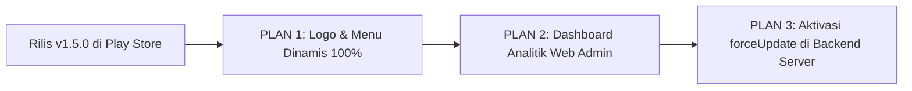

# 📌 MASTER ROADMAP & PLAN PENGEMBANGAN: KONSEL SETARA

Dokumen ini adalah **panduan acuan rencana kerja terpusat**. Kapan pun Anda memulai sesi kerja dan menanyakan *"apa plan selanjutnya?"*, dokumen ini menjadi acuan status pekerjaan yang sudah selesai dan antrean fitur yang siap dikerjakan.

---

## 🏆 STATUS TERAKHIR (RILIS v1.5.0)

| Komponen | Status | Catatan Rilis |
| :--- | :---: | :--- |
| **Mobile Android** | ✅ **SELESAI (v1.5.0)** | Bundle `app-release.aab` (kode versi `8`) siap diunggah ke Google Play Console. |
| **Database Pengunjung** | ✅ **SELESAI** | Tabel `app_visitors` terpasang di MySQL `konsel_setara`. |
| **Backend Visitor API** | ✅ **SELESAI** | Endpoint `/api/v1/visitors/hit` & `/api/v1/visitors/stats` aktif. |
| **Menu RUP & Ikon 3D** | ✅ **SELESAI** | Terpasang di aplikasi mobile dan database menu. |
| **Dokumentasi SOP Rilis** | ✅ **SELESAI** | Tersimpan di [docs/panduan-rilis-playstore.md](file:///Users/simplephi/Documents/riswan/konsel-setara/docs/panduan-rilis-playstore.md). |

---

## 🚀 DAFTAR ANTREAN PLAN PENGEMBANGAN SELANJUTNYA



---

### 🎯 PLAN 1: Sistem Upload Logo & Menu Dinamis (Admin & Backend)
> **Tujuan Utama**: Admin dapat menambah menu layanan baru (misal: website OPD, portal berita, atau direct link lain) beserta logonya **langsung dari Dashboard Web Admin, tanpa perlu build `.aab` ulang dan tanpa perlu update versi di Play Store**.

#### 1. Sisi Backend (`backend/`):
* **Library**: Menggunakan `multer` untuk menangani multipart/form-data upload gambar (PNG, JPG, SVG, WebP).
* **Penyimpanan**: Direktori publik server `backend/public/uploads/menu/`.
* **Endpoint Baru**:
  - `POST /api/v1/menu/upload`: Mengunggah gambar logo dan mengembalikan path/URL publik:  
    `https://konsel-setara.konaweselatankab.go.id/uploads/menu/nama-file.png`
* **Model Database**:
  - Kolom `img` pada tabel `menu_items` mendukung penyimpanan URL lengkap (`https://...`) selain path lokal.

#### 2. Sisi Web Admin (`admin/`):
* **Lokasi**: [admin/src/app/menu/page.tsx](file:///Users/simplephi/Documents/riswan/konsel-setara/admin/src/app/menu/page.tsx)
* **Penyempurnaan Form Tambah/Edit Menu**:
  - Ganti input teks biasa menjadi **Komponen Upload Logo (Drag & Drop + Image Preview)**.
  - Opsi ganda: Admin bisa **upload file logo dari laptop** ATAU memilih **Material Icons** jika tidak memiliki logo.

#### 3. Sisi Mobile Android (`frontend/`):
* **Lokasi**: [frontend/src/pages/IndexPage.vue](file:///Users/simplephi/Documents/riswan/konsel-setara/frontend/src/pages/IndexPage.vue)
* **Normalisasi Gambar**:
  - Helper cerdas untuk me-load logo: jika berawalan `http://` atau `https://`, gambar langsung di-load secara dinamis dari server internet.

---

### 🎯 PLAN 2: Modul Analitik & Statistik Pengunjung di Web Admin (`admin/`)
> **Tujuan Utama**: Menyajikan dashboard pemantauan statistik pengunjung aplikasi Konsel Setara secara komprehensif bagi pimpinan dan pengelola sistem Diskominfo.

#### 1. Sisi Backend (`backend/`):
* **Endpoint Baru**: `GET /api/v1/visitors/analytics?range=7|30|year`
* **Payload Respons**:
  - Ringkasan KPI: Total Pengunjung, Pengunjung Hari Ini, Bulan Ini, Rata-rata Harian, Hari Puncak (*Peak Day*).
  - Data Tren Harian: Array `{ date: '2026-09-28', count: 145 }` untuk kebutuhan grafik.
  - Komposisi Platform: Breakdown jumlah kunjungan dari `android`, `ios`, dan `web`.

#### 2. Sisi Web Admin (`admin/`):
* **Menu Baru Sidebar**: **Statistik Pengunjung** (`/visitors` atau `/analytics`).
* **Komponen Visual**:
  - **4 Kartu KPI Ringkasan**: Desain modern dengan badge persentase tren naik/turun.
  - **Grafik Tren Interaktif**: Visualisasi Area/Line Chart menggunakan library `recharts`.
  - **Filter Rentang Waktu**: Tombol cepat *7 Hari*, *30 Hari*, *Bulan Ini*, *Tahun Ini*.
  - **Tabel Log Kunjungan**: Rincian harian beserta jumlah hit per tanggal.

---

### 🎯 PLAN 3: Prosedur Pasca-Rilis Play Store (Aktivasi `forceUpdate`)
> **Waktu Eksekusi**: Dijalankan **SETELAH** aplikasi versi 1.5.0 disetujui Google dan status di Google Play Console menjadi *Tersedia di Google Play (Aktif)*.

* **Langkah Kerja**:
  1. Buka [backend/index.js](file:///Users/simplephi/Documents/riswan/konsel-setara/backend/index.js) di server produksi.
  2. Aktifkan baris:
     ```javascript
     latestVersion: '1.5.0',
     forceUpdate: true
     ```
  3. Restart backend server: `pm2 restart all`.
  4. Pengguna lama (v1.4.0) otomatis mendapatkan modal pembaruan wajib untuk beralih ke v1.5.0.

---

## 📌 CARA PENGGUNAAN PLAN INI
Setiap kali membuka sesi proyek berikutnya, Anda cukup mengatakan:  
👉 *"Lanjutkan Plan 1 (Upload Logo Dinamis)"* atau *"Lanjutkan Plan 2 (Dashboard Analitik Admin)"*, dan kita bisa langsung eksekusi tanpa perlu merancang ulang dari nol.
