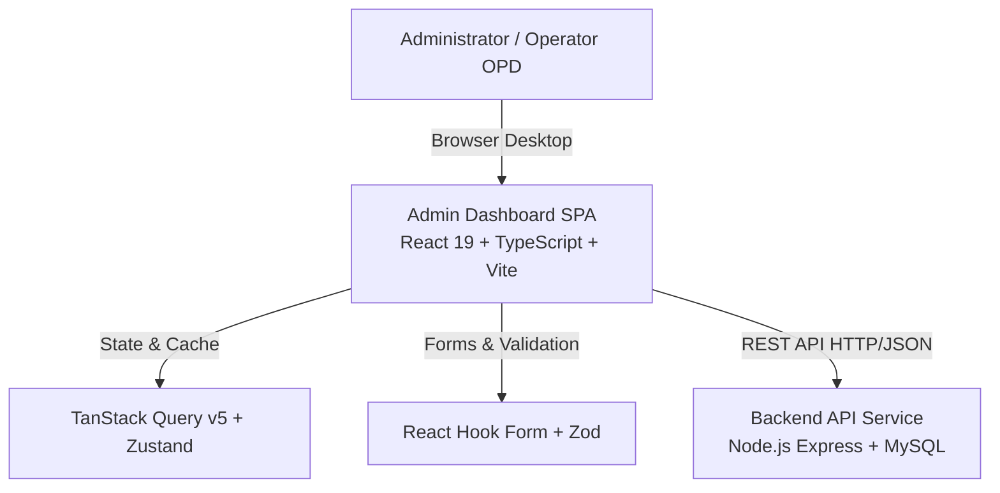

# Stack & Arsitektur Teknologi - Admin Dashboard Konsel Setara

Dokumen ini memuat rincian lengkap mengenai teknologi, arsitektur, pustaka (library), serta toolchain yang digunakan dalam pengembangan web panel **Admin Dashboard Konsel Setara (`/admin`)**.

---

## 1. Ringkasan Ekosistem & Arsitektur

Admin Dashboard Konsel Setara adalah aplikasi web Single Page Application (SPA) berbasis **React 19** dan **TypeScript**, didesain untuk operator OPD, verifikator layanan, administrator sistem, dan pimpinan daerah di Kabupaten Konawe Selatan.

---

## 2. Core Framework & Build Tool

| Teknologi | Pustaka / Package | Versi | Fungsi & Peran |
| :--- | :--- | :--- | :--- |
| **Framework Utama** | [React](https://react.dev/) | `^19.2.3` | Library UI inti berbasis komponen reaktif dengan React 19 features. |
| **Bahasa Pemrograman** | [TypeScript](https://www.typescriptlang.org/) | `~5.9.3` | Memberikan strict typing, static type checking, dan developer experience optimal. |
| **Build Engine / Bundler** | [Vite](https://vite.dev/) & `@vitejs/plugin-react` | `^7.3.0` / `^5.1.2` | Engine bundler modern dengan Hot Module Replacement (HMR) berkecepatan tinggi. |
| **Routing** | [React Router](https://reactrouter.com/) (`react-router-dom`) | `^7.11.0` | Client-side routing, nested routes, layout wrappers, dan protected route guards. |

---

## 3. Styling, Desain Sistem & Komponen UI (Shadcn UI)

Panel admin mengadopsi pola arsitektur desain sistem **Shadcn UI (New York style)** yang dibangun di atas primitive komponen Radix UI dan Tailwind CSS versi 4.

### A. Styling Engine
| Teknologi | Package | Versi | Fungsi |
| :--- | :--- | :--- | :--- |
| **CSS Framework** | [Tailwind CSS v4](https://tailwindcss.com/) (`@tailwindcss/vite`) | `^4.1.18` | Utility-first CSS engine v4 terbaru yang terintegrasi langsung dengan Vite. |
| **Class Utilities** | `clsx` & `tailwind-merge` | `^2.1.1` / `^3.4.0` | Penggabungan class conditional dan resolusi konflik class Tailwind. |
| **Variant Authority** | `class-variance-authority` (CVA) | `^0.7.1` | Pengelolaan varian komponen (primary, outline, ghost, sizes). |
| **Animasi CSS** | `tw-animate-css` | `^1.4.0` | Transisi dan animasi halus untuk elemen interaktif dashboard. |
| **Theme Switcher** | `next-themes` | `^0.4.6` | Manajemen mode tampilan Dark Mode / Light Mode terintegrasi. |

### B. Radix UI Primitives & Interactive Components
| Komponen UI | Package | Keterangan Penggunaan |
| :--- | :--- | :--- |
| **Dialog / Modal** | `@radix-ui/react-dialog` | Modal popup konfirmasi, detail data, dan dialog formulir create/edit. |
| **Dropdown & Menu** | `@radix-ui/react-dropdown-menu` | Menu aksi baris tabel (edit, hapus, detail) dan profile menu. |
| **Navigation & Sidebar** | `@radix-ui/react-navigation-menu`, `@radix-ui/react-collapsible` | Menu sidebar bertingkat (collapsible submenus). |
| **Form Controls** | `@radix-ui/react-checkbox`, `@radix-ui/react-radio-group`, `@radix-ui/react-switch`, `@radix-ui/react-select` | Elemen input form standar dengan aksesibilitas tinggi (ARIA). |
| **Data Display & Layout** | `@radix-ui/react-tabs`, `@radix-ui/react-accordion`, `@radix-ui/react-scroll-area`, `@radix-ui/react-separator`, `@radix-ui/react-avatar`, `@radix-ui/react-progress` | Tab navigasi konten, akordion FAQ/alur, custom scrollbar, avatar pengguna. |
| **Overlay & Helpers** | `@radix-ui/react-popover`, `@radix-ui/react-tooltip`, `@radix-ui/react-hover-card` | Tooltip info indikator, floating popover, dan hover preview. |
| **Slot Composition** | `@radix-ui/react-slot`, `@radix-ui/react-label` | Komposisi polimorfik komponen (`asChild`) dan label form. |
| **Toggle Controls** | `@radix-ui/react-toggle`, `@radix-ui/react-toggle-group` | Tombol toggle filter atau switcher view mode. |

### C. Advanced UI Add-ons
| Fitur | Package | Versi | Fungsi |
| :--- | :--- | :--- | :--- |
| **Command Palette** | `cmdk` | `^1.1.1` | Fitur pencarian cepat global / quick command bar (`Ctrl+K`). |
| **Mobile Drawer** | `vaul` | `^1.1.2` | Drawer gesture-driven yang halus untuk tampilan layar kecil/tablet. |
| **Notifikasi Toast** | `sonner` | `^2.0.7` | Toast feedback notifikasi (berhasil simpan, error, loading). |
| **Date Picker** | `react-day-picker` & `date-fns` | `^9.13.0` / `^4.1.0` | Kalender pemilihan tanggal, filter rentang waktu laporan, dan format tanggal. |
| **Resizable Panels** | `react-resizable-panels` | `^3.0.4` | Panel layout yang dapat diubah ukurannya secara fleksibel. |
| **Drag & Drop** | `@dnd-kit/core`, `@dnd-kit/sortable`, `@dnd-kit/modifiers`, `@dnd-kit/utilities` | `^6.3.1` s/d `^10.0.0` | Fitur pengurutan menu, prioritas slider banner, dan reordering modul. |
| **Ikon** | [Lucide React](https://lucide.dev/) | `^0.562.0` | Set icon vektor konsisten untuk seluruh UI admin. |

---

## 4. State Management, Data Fetching & Form Handling

| Kategori | Package | Versi | Deskripsi & Peran |
| :--- | :--- | :--- | :--- |
| **Server State & Cache** | [@tanstack/react-query](https://tanstack.com/query/latest) | `^5.102.8` | Pengambilan data asynchronous dari backend, auto-caching, deduplication request, dan background refetching. |
| **Client State Global** | [Zustand](https://zustand-demo.pmnd.rs/) | `^5.0.9` | State store client-side yang ringan untuk sesi autentikasi, status sidebar, dan preferensi UI. |
| **HTTP Client** | [Axios](https://axios-http.com/) | `^1.20.0` | Instance client HTTP terpusat dengan interceptor Bearer Token JWT & error handling. |
| **Form Management** | [React Hook Form](https://react-hook-form.com/) | `^7.69.0` | Manajemen state form performa tinggi tanpa re-render berlebih. |
| **Validasi Skema** | [Zod](https://zod.dev/) & `@hookform/resolvers` | `^4.3.2` / `^5.2.2` | Deklarasi skema validasi tipe-aman untuk seluruh input data admin. |

---

## 5. Visualisasi Data & Manajemen Tabel

| Kategori | Package | Versi | Deskripsi & Peran |
| :--- | :--- | :--- | :--- |
| **Tabel Data Headless** | [@tanstack/react-table](https://tanstack.com/table/latest) | `^8.21.3` | Menangani tabel data master yang besar dengan sorting, filtering, searching, pagination, dan column visibility. |
| **Grafik / Charting** | [Recharts](https://recharts.org/) | `3.6.0` | Visualisasi statistik pengunjung, grafik realisasi permohonan, tren ulasan, dan ringkasan eksekutif. |

---

## 6. Code Quality, Linter & Toolchain

| Tool | Package | Versi | Peran |
| :--- | :--- | :--- | :--- |
| **Linter** | ESLint 9 (`@eslint/js`, `typescript-eslint`) | `^9.39.2` / `^8.51.0` | Linting aturan kode TypeScript & standar ECMAScript terbaru. |
| **React Hooks Lint** | `eslint-plugin-react-hooks` | `^7.0.1` | Memastikan kepatuhan aturan Rules of Hooks. |
| **Fast Refresh Lint** | `eslint-plugin-react-refresh` | `^0.4.26` | Validasi komponen untuk mendukung hot reload tanpa kehilangan state. |
| **Type Definitions** | `@types/react`, `@types/react-dom`, `@types/node` | `^19.x` / `^25.x` | Type definitions untuk compiler TypeScript. |

---

## 7. Ringkasan Modul yang Tersedia di Admin Panel
 
Berdasarkan struktur aplikasi (`/admin/src/app`):
1. **Dashboard (`/dashboard`)**: Ringkasan statistik eksekutif, chart aktivitas, metrik IKM/SKM, dan indikator utama pelayanan daerah.
2. **Aplikasi (`/aplikasi`)**: Pengelolaan master aplikasi dan portal layanan terintegrasi lintas OPD.
3. **Menu (`/menu`)**: Pengaturan hierarki navigasi, menu dinamis, pengurutan drag-and-drop, dan konfigurasi hak akses.
4. **Pegawai (`/pegawai`)**: Manajemen data aparatur/petugas pelayanan publik, filter jabatan, unit kerja, modal formulir, dan status keaktifan.
5. **Realisasi (`/realisasi`)**: Monitoring status realisasi permohonan, verifikasi tindak lanjut dokumen, filter periode tanggal, dan rekapitulasi performa pelayanan.
6. **Slider (`/slider`)**: Manajemen banner carousel dan pengumuman pada aplikasi mobile/PWA.
7. **Ulasan & SKM (`/ulasan`)**: Monitoring feedback masyarakat, ringkasan skor Mutu Pelayanan & Indeks Kepuasan Masyarakat (IKM), grafik distribusi bintang, dan agregasi 9 unsur survei.
8. **Users (`/users`)**: Manajemen akun pengguna terpadu, hak akses per role, dan autentikasi.
9. **Settings & Auth (`/settings`, `/auth`)**: Konfigurasi tema, preferensi sistem, dan form login/otentikasi.

