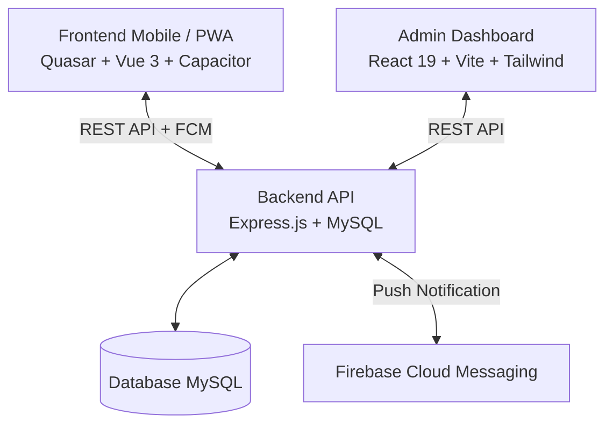

# Stack & Arsitektur Teknologi - Konsel Setara

Dokumen ini memuat daftar lengkap teknologi, framework, pustaka (library), serta runtime yang digunakan dalam pengembangan ekosistem **Konsel Setara (Konawe Selatan Setara)**, dengan fokus mendalam pada modul **Frontend (Mobile App & PWA)** serta keterhubungannya dengan modul **Backend** dan **Admin Panel**.

---

## 1. Arsitektur Umum Ekosistem

Aplikasi **Konsel Setara** dibangun dengan arsitektur modular yang terbagi menjadi 3 komponen utama:

1. **Frontend (`/frontend`)**: Aplikasi mobile multi-platform (Android & Web/PWA) untuk masyarakat Konawe Selatan.
2. **Backend (`/backend`)**: Layanan RESTful API untuk pemrosesan bisnis, database, upload file, dan push notifikasi.
3. **Admin Dashboard (`/admin`)**: Panel administrasi berbasis web untuk operator OPD, verifikator, dan pimpinan daerah.

---

## 2. Frontend (Mobile App / PWA)

Modul Frontend dibangun menggunakan arsitektur hybrid modern dengan kombinasi **Vue 3**, **Quasar Framework**, dan **Capacitor** untuk menghasilkan output Android APK/AAB serta Web/SPA.

### A. Core Framework & Build System
| Komponen | Teknologi / Library | Versi | Fungsi / Kegunaan |
| :--- | :--- | :--- | :--- |
| **Framework Utama** | [Vue.js](https://vuejs.org/) | `^3.5.22` | Reactive component-based framework (SPA & Mobile). |
| **UI Framework** | [Quasar Framework](https://quasar.dev/) | `^2.16.0` | UI component suite berbasis Material Design dan cross-platform builder. |
| **Build Engine** | `@quasar/app-vite` (Vite) | `^2.1.0` | Fast HMR (Hot Module Replacement) bundler & build tool. |
| **State Management** | [Pinia](https://pinia.vuejs.org/) | `^3.0.4` | Global state management terpusat (User store, Auth, Notifikasi). |
| **Routing** | [Vue Router](https://router.vuejs.org/) | `^4.0.0` | SPA page navigation, history mode, & navigation guards. |

### B. Hybrid Mobile & Native Bridges (Capacitor)
| Plugin / Bridge | Library | Versi | Fungsi / Kegunaan |
| :--- | :--- | :--- | :--- |
| **Mobile Runtime** | `@capacitor/core` & `@capacitor/android` | `^8.3.0` | Container native runtime untuk Android platform. |
| **Kamera & Media** | `@capacitor/camera` | `^8.1.0` | Pengambilan foto langsung dari kamera HP atau galeri perangkat. |
| **Live Camera View** | `@capacitor-community/camera-preview` | `^8.0.0` | Preview kamera langsung dalam layar UI (misal: verifikasi presensi/wajah). |
| **Geolokasi** | `@capacitor/geolocation` | `^8.2.0` | Mendapatkan koordinat GPS real-time pengguna untuk pelaporan/layanan publik. |
| **Push Notification** | `@capacitor/push-notifications` | `^8.0.3` | Integrasi notifikasi push native melalui Firebase Cloud Messaging (FCM). |
| **File System** | `@capacitor/filesystem` | `^8.1.2` | Pengelolaan, pembacaan, dan penyimpanan file lokal di memori perangkat. |
| **File Viewer** | `@capacitor/file-viewer` | `^2.0.1` | Membuka dan menampilkan file (PDF/dokumen) menggunakan native viewer Android. |
| **Splash Screen** | `@capacitor/splash-screen` | `^8.0.1` | Menampilkan dan mengatur transisi layar splash aplikasi saat startup. |
| **App State** | `@capacitor/app` | `^8.1.0` | Menangani lifecycle aplikasi mobile (back button native, app pause/resume). |

### C. Data Fetching, Visualisasi & UI Add-ons
| Kategori | Library | Versi | Fungsi / Kegunaan |
| :--- | :--- | :--- | :--- |
| **HTTP Client** | [Axios](https://axios-http.com/) | `^1.14.0` | Request HTTP ke Backend API dengan interceptor token dan error handling. |
| **Grafik & Visualisasi** | [ApexCharts](https://apexcharts.com/) & `vue3-apexcharts` | `^5.10.6` / `^1.11.1` | Pembuatan grafik analitik, statistik pelayanan, dan infografis interaktif. |
| **Grafik Lanjutan** | [Highcharts](https://www.highcharts.com/) | `^12.6.0` | Visualisasi chart data statistik khusus. |
| **PDF Rendering** | [PDF.js](https://mozilla.github.io/pdf.js/) (`pdfjs-dist`) | `^5.6.205` | Render dan preview dokumen PDF langsung di dalam browser/aplikasi. |
| **Slider / Carousel** | [Swiper](https://swiperjs.com/) | `^12.1.3` | Banner slider informasi, carousel pengumuman, dan swipeable galeri. |
| **Drag & Drop** | `vuedraggable` | `^4.1.0` | Interaksi drag-and-drop elemen daftar / formulir dinamis. |
| **Icon Set** | `@quasar/extras` | `^1.17.0` | Paket icon Material Icons, Material Symbols, MDI, dan FontAwesome. |

### D. CSS & Code Quality Tools
| Tool | Library | Versi | Fungsi |
| :--- | :--- | :--- | :--- |
| **CSS Preprocessor** | Sass/SCSS | Built-in Quasar | Pengorganisasian style global, variabel warna pemda, dan utility classes. |
| **CSS Processor** | PostCSS & Autoprefixer | `^8.4.14` / `^10.4.2` | Vendor prefixing otomatis untuk kompatibilitas lintas browser mobile. |
| **Linter** | ESLint 9 (`@eslint/js`, `vue-eslint-parser`) | `^9.14.0` | Pengecekan kualitas kode dan kepatuhan standar Vue 3. |
| **Code Formatter** | Prettier (`@vue/eslint-config-prettier`) | `^3.3.3` | Standardisasi format kode otomatis. |

---

## 3. Backend (RESTful API Service)

Modul Backend bertindak sebagai pusat pengolahan data dan logika bisnis aplikasi.

| Kategori | Teknologi / Library | Versi | Keterangan |
| :--- | :--- | :--- | :--- |
| **Runtime & Server** | [Node.js](https://nodejs.org/) & [Express.js](https://expressjs.com/) | `v5.2.1` | REST API framework generasi terbaru (Express 5). |
| **Database Driver** | [MySQL2](https://github.com/sidorares/node-mysql2) | `^3.16.1` | Koneksi performa tinggi ke basis data relasional MySQL. |
| **Database NoSQL** | [MongoDB Driver](https://www.mongodb.com/) | `^7.6.0` | Driver database NoSQL untuk penyimpanan log dokumen fleksibel. |
| **Autentikasi** | [JSON Web Token (JWT)](https://jwt.io/) & [Bcryptjs](https://github.com/dcodeIO/bcrypt.js) | `^9.0.3` / `^3.0.3` | Enkripsi kata sandi (hashing) dan autentikasi berbasis Bearer Token. |
| **Validasi Skema** | [Joi](https://joi.dev/) | `^18.0.2` | Validasi payload request body, query params, dan formulir input. |
| **Generator ID** | [Uniqid](https://github.com/adamhalasz/uniqid) | `^5.4.0` | Generator ID unik 18-karakter berbasis timestamp untuk transaksi formulir & survei. |
| **File Upload** | [Multer](https://github.com/expressjs/multer) | `^2.0.2` | Menangani multipart/form-data upload dokumen KTP, berkas izin, dan foto. |
| **Push Notification** | [Firebase Admin SDK](https://firebase.google.com/docs/admin/setup) | `^13.8.0` | Pengiriman notifikasi broadcast dan personal ke perangkat pengguna (FCM). |
| **Email Service** | [Nodemailer](https://nodemailer.com/) | `^8.0.5` | Pengiriman notifikasi email verifikasi dan status pengajuan layanan. |
| **Keamanan & Env** | `cors`, `dotenv` | `^2.8.5` / `^17.2.3` | Konfigurasi CORS policy dan manajemen environment variable. |
| **Dev Tool** | [Nodemon](https://nodemon.io/) | `^3.1.11` | Auto-reload server backend saat perubahan kode terjadi. |

---

## 4. Admin Panel (Dashboard Web)

Modul Admin Dashboard diperuntukkan bagi petugas dinas dan administrator daerah.

| Kategori | Teknologi / Library | Versi | Keterangan |
| :--- | :--- | :--- | :--- |
| **Core Framework** | [React 19](https://react.dev/) + [TypeScript](https://www.typescriptlang.org/) | `^19.2.3` / `~5.9.3` | UI Library modern dengan full type safety. |
| **Bundler** | [Vite 7](https://vite.dev/) | `^7.3.0` | High-speed frontend build tool. |
| **CSS Framework** | [Tailwind CSS v4](https://tailwindcss.com/) (`@tailwindcss/vite`) | `^4.1.18` | Utility-first CSS framework engine versi 4. |
| **UI Components** | [Radix UI Primitives](https://www.radix-ui.com/) + Shadcn UI patterns | Beragam | Komponen aksesibel (Dialog, Dropdown, Accordion, Select, Tabs, Popover). |
| **Data Fetching** | [TanStack Query v5](https://tanstack.com/query/latest) | `^5.102.8` | Server state management, caching, dan invalidation. |
| **Tabel Data** | [TanStack Table v8](https://tanstack.com/table/latest) | `^8.21.3` | Headless table untuk data master yang kompleks dan filterable. |
| **Form Handling** | [React Hook Form](https://react-hook-form.com/) + [Zod](https://zod.dev/) | `^7.69.0` / `^4.3.2` | Validasi formulir deklaratif berbasis skema Zod. |
| **State Global** | [Zustand](https://zustand-demo.pmnd.rs/) | `^5.0.9` | State management ringan dan modular. |
| **Chart & Grafik** | [Recharts](https://recharts.org/) | `3.6.0` | Komponen visualisasi data statistik dashboard. |
| **Ikon** | [Lucide React](https://lucide.dev/) | `^0.562.0` | Set icon modern dan clean. |

---

## 5. Ringkasan Modul & Fitur Baru yang Diimplementasikan

1. **Survei Kepuasan Masyarakat (SKM) & Indeks IKM**:
   * Komponen kuesioner survei publik di Mobile/PWA (`frontend/src/components/Skm.vue`).
   * Tombol floating action SKM di seluruh modul dashboard pelayanan publik.
   * Modul rekapitulasi, visualisasi grafik rating, dan agregasi 9 unsur SKM di Admin (`admin/src/app/ulasan/page.tsx`).
2. **Monitoring & Tracking Realisasi Permohonan**:
   * Dashboard pelacakan realisasi di Mobile/PWA (`frontend/src/pages/Realisasi/Dashboard.vue`).
   * Panel manajemen verifikasi dan update status realisasi dokumen di Admin (`admin/src/app/realisasi/page.tsx`).
3. **Manajemen Pegawai & Petugas Pelayanan**:
   * CRUD data aparatur/petugas pelayanan terintegrasi di Admin (`admin/src/app/pegawai/page.tsx`).
4. **Desain Sistem & Komponen UI Admin**:
   * Penyempurnaan komponen `Select` berbasis Radix UI pada dialog formulir dan filter data.

---

## 6. Ringkasan Ekosistem & Perangkat Lunak Pendukung

* **Mobile App ID**: `id.go.konaweselatankab.setara`
* **Target Runtime Platform**: Android 8.0+ (API Level 26+) & Modern Web Browsers
* **Node.js Environment**: Direkomendasikan Node.js v20.x LTS / v22.x LTS
* **Database Engine**: MySQL 8.x / MariaDB 10.x & MongoDB 7.x

